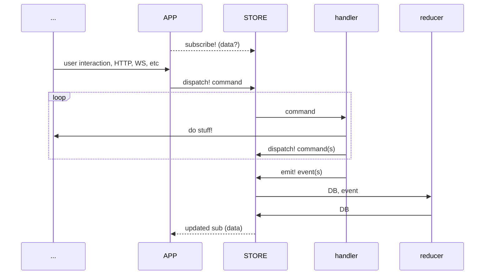

# defacto

The `defacto` state store library. A [lightweight](https://github.com/skuttleman/defacto/blob/master/deps.edn),
highly customizable state store for clojure(script). You've heard of **re-frame** or **redux**? Same patterns. New glue.

## Usage

```clojure
(require '[defacto.core :as defacto])
(require '[clojure.core.async :as async])

;; make some command handlers
(defmethod defacto/command-handler :stuff/create!
  [{::defacto/keys [store] :as ctx-map} [_ command-arg :as _command] emit-cb]
  (do-stuff! ctx-map command-arg)
  ;; command handlers can do work synchronously and/or asynchronously
  (async/go
    (let [result (async/<! (do-more-stuff! ctx-map command-arg))]
      (if (success? result)
        (do
          (async/<! (do-more-more-stuff! ctx-map command-arg))
          (emit-cb [:stuff/created command-arg]))
        (defacto/dispatch! store [:another/command! result])))))

;; make some event handlers
(defmethod defacto/event-reducer :stuff/created
  [db [_ value :as _event]]
  (assoc db :stuff/value value))

;; make some subscription handlers
(defmethod defacto/query-responder :stuff/?:stuff
  [db [_ default]]
  (or (:stuff/value db) default))


;; make a store
(def my-store (defacto/create {:some :ctx} {:stuff/value nil}))

;; make a subscription
(def subscription (defacto/subscribe my-store [:stuff/?:stuff 3]))

;; dispatch a command
(defacto/dispatch! my-store [:stuff/create! 7])

;; emit an event
(defacto/emit! my-store [:some/event {...}])
```

## Use with Reagent

I love [reagent](https://github.com/reagent-project/reagent), and I use it for all my cljs UIs. Making a
reactive `reagent` store with `defacto` is super easy!

```clojure
(ns killer-app.core
  (:require
    [cljs.core.async :as async]
    [cljs-http.client :as http]
    [defacto.core :as defacto]
    [reagent.core :as r]
    [reagent.dom :as rdom]))

(def component [store]
  (r/with-let [sub (defacto/subscribe [:some/?:page-data 123])]
    (let [{:keys [status data error]} @sub]
      [:div.my-app
       [:h1 "Hello, app!"]
       [:button {:on-click #(defacto/dispatch! store [::fetch-data! 123])}
        "fetch data"]
       [:div
        (case status
          :ok data
          :bad error
          "nothing yet")]])))

                                  ;; anything can go in the `ctx-map`, such
(defn app-root []                 ;; as fns you may want to mock/stub in tests
  (r/with-let [store (defacto/create {:http-fn http/request} {:init :db} {:->sub r/atom})]
                                                                      ;; using [[r/atom]] gets you
                                                                      ;; **reactive subscriptions**!!
    [component store]))

(rdom/render [app-root] (.getElementById js/document "root"))

(defmethod defacto/command-handler ::fetch-data!
  [{::defacto/keys [store] :keys [http-fn]} [ id] emit-cb]
  (async/go
    (let [result (async/<! (http-fn {...}))
          ;; deref-ing the store is NOT reactive and can be used inside command handlers
          current-db @store
          ;; then you can query the db directly instead of using reactive subscriptions
          page-data (defacto/query-responder current-db [:some/?:page-data])]
      (do-something-with page-data)
      (if (= 200 (:status result))
        (emit-cb [::fetch-succeeded {:id id :data (:body result)}])
        (emit-cb [::fetch-failed {:id id :error (:body result)}])))))

(defmethod defacto/event-reducer ::fetch-succeeded
  [db [_ {:keys [id data]}]]
                     ;; query the db from events or other queries
  (let [current-data (defacto/query-responder db [:some/?:page-data id])]
    (assoc-in db [:my-data id] (merge current-data {:status :ok :data data}))))

(defmethod defacto/event-reducer ::fetch-failed
  [db [_ {:keys [id error]}]]
  (assoc-in db [:my-data id] {:status :bad :data error}))

(defmethod defacto/query-responder :some/?:page-data
  [db [_ id]]
  (get-in db [:my-data id]))
```

## Concepts

The design is vaguely [CQS](https://en.wikipedia.org/wiki/Command%E2%80%93query_separation) (like most state stores).
Here are the concepts and conventions that `defacto` uses.

### Commands

`command` - a message "dispatched" through `defacto` via `defacto.core/dispatch!`. It should be a vector with
a keyword in first position. Prefer qualified keywords which are _present-tense verbs_ ending with a `!`.

`action` - the keyword in first position of a `command` vector.

`handler` - the implementation for handling a specific `command` `action`.

```clojure
;; example command
[:my.domain/create-thing! {:thing :params}]
```

### Events

`event` - a message "emitted" through `defacto` via dispatching a `command` (or `defacto.core/emit!` for convenience).
It should be a vector with a keyword in first position. Prefer qualified keywords which are _past-tense verbs_.

`event-type` - (aka `type`) is the keyword in first position of an `event` vector.

`reducer` - the implementation for updating the db value in response to a specific `event` `type`. The `reducer`
_must_ be a **pure function**.

```clojure
;; example event
[:my.domain/thing-created {:thing :details}]
```

### Queries

`query` - a message used to request data from `defacto`'s database. It should be a vector
with a keyword in first position. Prefer qualified keywords which are _nouns_. I like prefixing the *name* with `?:`
to make them stand out more in code.

`resource` - the keyword in first position of a `query` vector.

`responder` - the implementation for finding data in the db relevant to a specific `query` `resource`. The `responder`
_must_ be a **pure function**.

`subscription` - a deref-able, watch-able ref type that will update when the result of a query changes.

```clojure
;; example query
[:my.domain/?:thing {:id 123}]
```

## How?



## Why?

Good question. [re-frame](https://github.com/day8/re-frame) is awesome, but it's too heavy-weight for my purposes.
Sometimes I just want to build things out of tiny, composable pieces.
